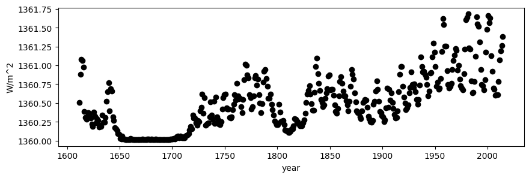
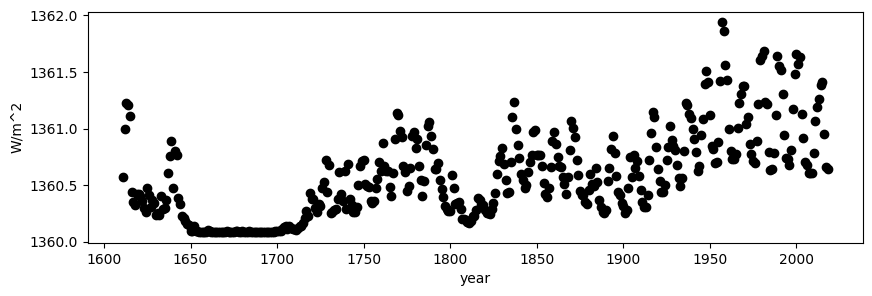
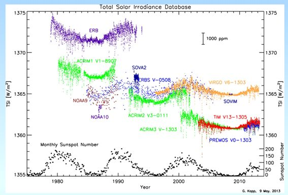

# global-warming
Global warming is advancing every year. Total solar irradiance (TSI) is also increasing every year.  Remember that measurements of the Sun from space began in November 1978. Data before 1978 is vulnerable or uncertain.

solarplot.py (Python2) or solarplot_py3.py (Python3) is a program to plot total solar irradiance from 1610 to 2014.

solar.lean2015.ann1610-2014.txt should be downloaeded from NASA site:

https://data.giss.nasa.gov/modelforce/solar.irradiance/solar.lean2015.ann1610-2014.txt

<pre>
$ python2 solarplot.py
or
$ python3 solarplot_py3.py
</pre>

test.png is the result.

===========
# NOAA TSI

https://www.ncei.noaa.gov/data/total-solar-irradiance/access/ancillary-data/tsi-ssi_v02r01_observed-tsi-composite_s19780101_e20200930_c20201026.txt

NOAA file is based on netCDF4.
In order to read .nc file, you can use netCDF4 library.
<pre>
$ pip install netCDF4
You have to download tsi_v02r01_yearly_s1610_e2018_c20190409.nc file:

https://www.ncei.noaa.gov/data/total-solar-irradiance/access/yearly/tsi_v02r01_yearly_s1610_e2019_c20200226.nc

To generate TSI file (noaaTSI1610-2019)
$ python readNC.py|grep 136 >noaaTSI1610-2019

To generate year and TSI file(t.csv) 
$ python noaa.py

t.csv can be generated. 

To generate noaa.png, run the following command
$ python noaaplot.py
</pre>

noaa.png is finally generated.

=======
# global temperature and co2 density

<pre>
# exercise for students

Download co2_mm_mlo.txt from the following site:

ftp://aftp.cmdl.noaa.gov/products/trends/co2/co2_mm_mlo.txt

You can modify co2.py to cope with co2_mm_mlo.txt where text file has 8 chunks.

</pre>

ftp://aftp.cmdl.noaa.gov/products/trends/co2/co2_weekly_mlo.txt

Global ocean temperature and Land temperature can be downloaded:
(temperature anomalies, deviations from the corresponding 1951-1980 means)

https://www.ncdc.noaa.gov/cag/global/time-series/globe/land/1/3/1958-2019
<pre>
In order to obtain the co2 density from 1978 to present, run the following command.
$ python co2.py

co2.png is generated by co2.py

$ python co2_v2.py   python2.X
to generate co2 density from Jan.2016 to present.
$ python co2_v3.py python3.X

In order to obtain the global temperature, run the following command.
Download GLB.Ts+dSST.csv file:
https://data.giss.nasa.gov/gistemp/tabledata_v3/https://data.giss.nasa.gov/gistemp/tabledata_v3/GLB.Ts+dSST.csv

$ python gtemp.py
In order to calculate the correlation coefficient,
$ python corr.py
</pre>

# TSI measurement technology with uncertainty
tsi.jpg 
shows uncertainty in TSI measurement:

ftp://ftp.ncdc.noaa.gov/pub/data/sds/cdr/presentations/2009/pilewskie-2013.pdf
